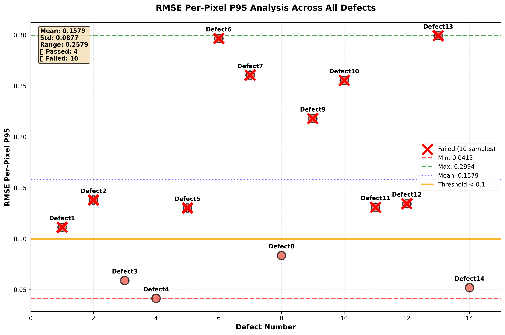
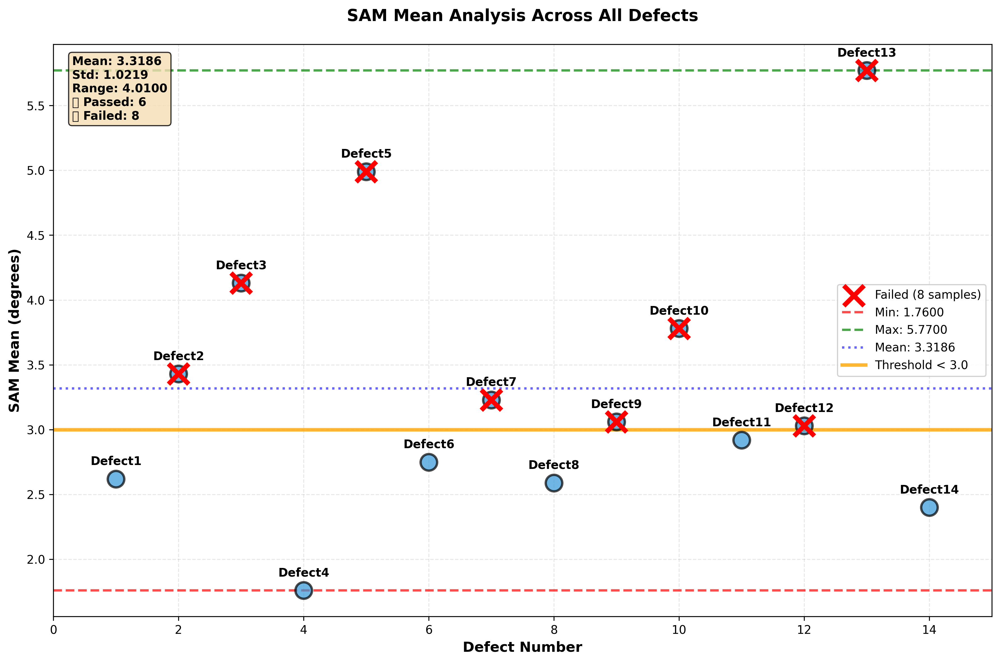
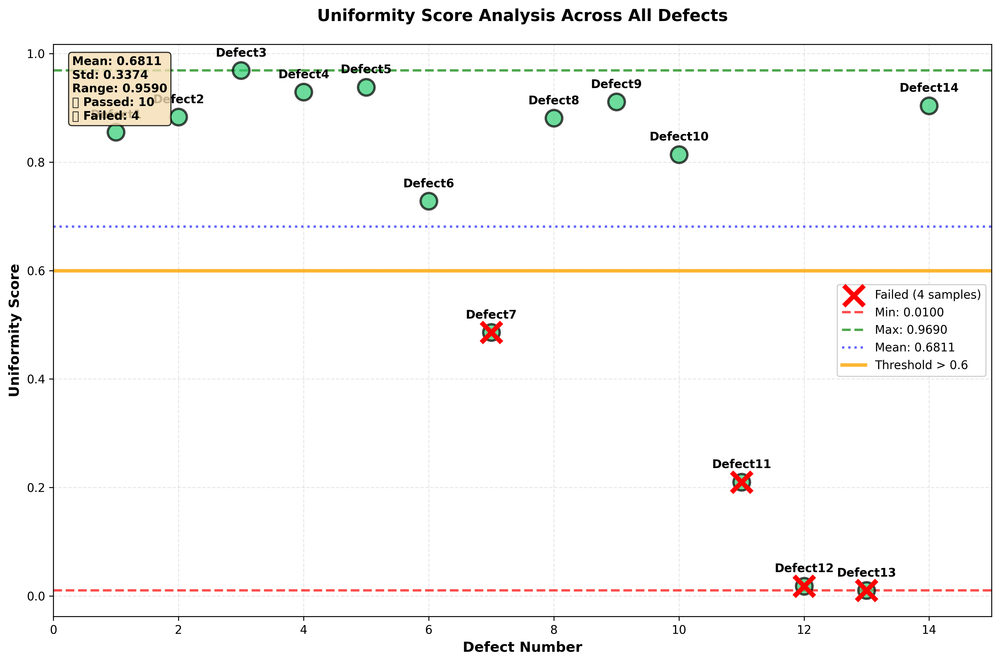
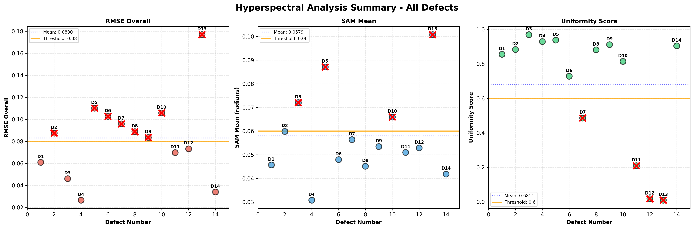

# Hyperspectral Defect Analysis

Fast pipeline to analyze waveguide IC grating defects from hyperspectral TIFF cubes. It detects fiducials, finds the IC circle, registers the sample to the reference, computes reflectance, and outputs raw quality metrics (RMSE, SAM, Ring Delta, Uniformity). Then you can make cross‑sample scatter plots.

---
## 1. Install
```bash
# Clone (or unzip) repo, then inside project root
python3 -m venv .venv
source .venv/bin/activate  # macOS / Linux
pip install -r requirements.txt
```

---
## 2. Data Folder Layout
Set `base_path` in `config.json` to the root that holds all spectral folders.
Expected structure (names are case‑sensitive):
```
<base_path>/
  reference/            # Reference device hyperspectral cubes
  white/                # White calibration cubes
  Darkreference/        # Dark calibration cubes
  Defect1/              # Sample defect folders (DefectN)
  Defect2/
  ...
```
Inside each folder are wavelength TIFFs named:
```
Image_Cube_<wl>.tif   # e.g. Image_Cube_450.tif, 460, ..., 950 (step 10 nm)
```
You can restrict processing to a wavelength sub‑range using `analysis_parameters.wavelength_range` in `config.json` (e.g. 450–800 nm). The code loads cubes, then crops only bands in that range.

---
## 3. Configure
Edit `config.json` before running.
Key fields:
```
"data_paths": {
  "base_path": "/absolute/path/to/IDP Group C",
  "samples": ["Defect1", "Defect2", "Defect5"],
  "results_dir_prefix": "results/complete_analysis_"
},
"analysis_parameters": {
  "analysis_wavelength": 650,         # Band used for circle & fiducials
  "wavelength_range": {"min":450, "max":800, "step":10},
  "circle_crop_region": [topFrac, bottomFrac, leftFrac, rightFrac],
  "num_sectors": 8,                   # For uniformity
  "num_fiducials": 4
},
"visualization_parameters": {
  "generate_plots": true,
  "padding_factor": 1.4,
  "inner_radius_fraction": 0.2,
  "outer_radius_fraction": 0.8
},
"quality_thresholds": {
  "rmse_overall_max": 0.08,
  "sam_mean_max": 0.06,
  "uniformity_score_min": 0.7
}
```
Adjust `samples` to the defect folders you want to process. Thresholds control pass/fail marking in scatter plots.

Configured in `quality_thresholds`:
- Pass if `RMSE_Overall < rmse_overall_max`
- Pass if `SAM_Mean < sam_mean_max`
- Pass if `Uniformity_Score > uniformity_score_min`
A sample that passes all three is reported in `high_quality_samples.csv`.

---
## 4. Run Pipeline
1. Prepare config → `config.json`
2. Run full per‑sample analysis:
```bash
python main.py
```
Results per sample in:
```
results/complete_analysis_<DefectN>/analysis_summary.csv
```
3. Generate cross‑sample scatter plots:
```bash
python generate_score_plots.py
```
This reads every `analysis_summary.csv` for the listed samples and creates plots in:
```
results/scatter_plots/
```
Generated files:
- `RMSE_Overall_Scatter.png`
- `SAM_Mean_Scatter.png`
- `Uniformity_Score_Scatter.png`
- `Combined_Analysis_Scatter.png`
- `batch_analysis_summary.csv` (raw table)
- `high_quality_samples.csv` (only samples passing all thresholds)

Samples failing a threshold are marked with a red X on that metric plot.

---
## 5. Metrics
All metrics are computed only inside the IC ROI (circle) after registration and reflectance correction.

### RMSE Overall
Formula:
```
RMSE = sqrt( mean( (R_ref - R_sample)^2 ) )  over all ROI pixels & bands
```
Meaning: Global spectral difference magnitude. Lower = closer match. We also compute per‑pixel RMSE then average (`rmse_per_pixel_mean`) for spatial view.

### SAM (Spectral Angle Mapper)
Per pixel:
```
SAM = arccos( (r · s) / (||r|| * ||s||) )   (r = reference spectrum, s = sample spectrum)
```
Range: 0 → π. Lower angle = spectra align (shape & relative proportions). We report mean and median over ROI and show a SAM map.

### Ring Delta
Compare SAM inside vs near outer edge of ROI:
```
inner_mean = mean(SAM within inner_radius = max_radius * inner_frac)
outer_mean = mean(SAM where radius >= max_radius * outer_frac)
Ring Delta = |outer_mean - inner_mean|
```
Meaning: Edge vs center spectral consistency. Near zero = uniform radial behavior.

### Uniformity Score (U)
Steps:
1. Divide ROI into `num_sectors` angular sectors.
2. Take median SAM per sector → `sector_meds`.
3. Robust stats:
```
med = median(sector_meds)
mad = median(|sector_meds - med|)
rCV = mad / (med + eps)
RR  = (max - min) / (med + eps)
```
4. Normalize with fixed thresholds:
```
T_rCV = 0.30
T_RR  = 1.40
rCVn = clip(rCV / T_rCV, 0, 1)
RRn  = clip(RR  / T_RR, 0, 1)
```
5. Blend:
```
alpha = 0.6
U = 1 - (alpha * rCVn + (1 - alpha) * RRn)
clip U to [0,1]
```
Meaning: 1.0 = sectors very similar (high uniformity). Lower values = more angular variation.

---
## 6. Scatter Plots (After Running)
Below are the plot references (will show once generated):






Red X = metric fails threshold. Orange line = threshold. Blue dotted line = mean.

